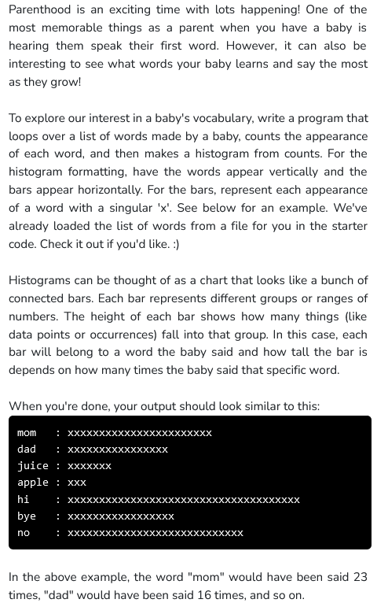

```python
def main():
    words = load_words_from_file("words.txt")
    #will contain all the words

    unique_words = dict.fromkeys(words)
    #will contain only the unique words

    for word in words:
        count = words.count(word)
        unique_words[word] = count
    #counts how many times the words are present in 
    #the list 'words' and stores that value as the 
    #value of that key in the dictionery 'unique_words'
    
    for key in unique_words:
        print_histogram_bar(key, unique_words[key])

def print_histogram_bar(word, count):
    """
    Prints one bar in the histogram.
    
    Uses formatted strings to do so. The 
        {word : <8}
    adds white space after a string to make
    the string take up 8 total characters of space.
    This makes all of our words on the left of the 
    histogram line up nicely. On the other end,
        {'x' * count}
    takes the 'x' string and duplicates it by 'count'
    number of times. So 'x' * 5 would be 'xxxxx'.
    
    Calling print_histogram_bar("mom", 7) would print:
        mom     : xxxxxxx
    """
    print(f"{word : <8}: {'x' * count}")

def load_words_from_file(filepath):
    """
    Loads words from a file into a list and returns it.
    We assume the file to have one word per line.
    Returns a list of strings. You should not modify this
    function.
    """
    words = []
    with open(filepath, 'r') as file_reader:
        for line in file_reader.readlines():
            cleaned_line = line.strip()
            if cleaned_line != '':
                words.append(cleaned_line)
    
    return words

if __name__ == '__main__':
    main()

```