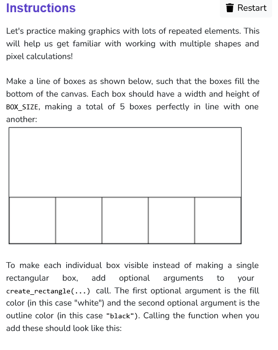
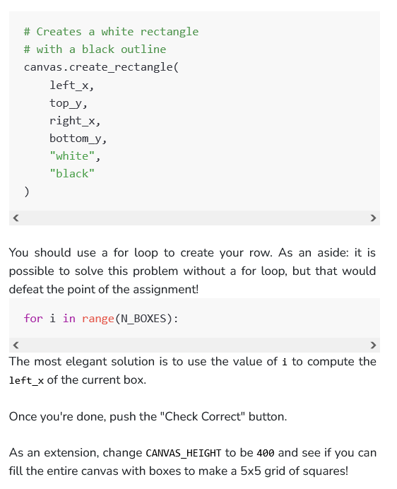

```python
from graphics import Canvas

CANVAS_WIDTH = 400
CANVAS_HEIGHT = 200
N_BOXES = 5
BOX_SIZE = CANVAS_WIDTH / N_BOXES

def main():
    canvas = Canvas(CANVAS_WIDTH, CANVAS_HEIGHT)

    for i in range (N_BOXES+1):
        canvas.create_rectangle(
        BOX_SIZE*(i-1), 
        CANVAS_HEIGHT-BOX_SIZE, 
        BOX_SIZE*i, 
        CANVAS_HEIGHT, 
        "white",
        "black"
    )

if __name__ == '__main__':
    main()
    
```