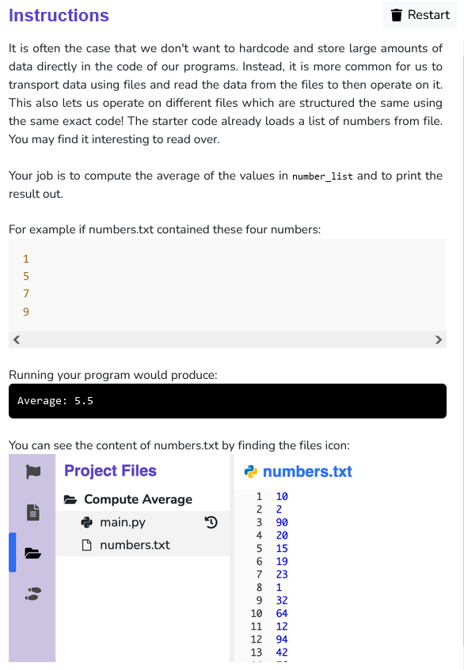

```python
def find_average(numbers):
    #calculating sum of the list of numbers
    sum_of_nums = 0
    for i in range (len(numbers)):
        sum_of_nums += numbers[i]
    #returning the avg of the numbers
    return sum_of_nums/len(numbers)

def main():
    number_list = load_numbers_from_file("numbers.txt")
    #storing the calculated avg in a variable
    avg = find_average(number_list)
    #printing the avg
    print("Average: "+ str(round(avg,1)))


def load_numbers_from_file(filepath):
    """
    Loads numbers from a file into a list and returns it.
    We assume the file to have one number per line.
    Returns a list of numbers. You should not modify this
    function.
    """
    numbers = []
    with open(filepath, 'r') as file_reader:
        for line in file_reader.readlines():
            cleaned_line = line.strip()
            if cleaned_line != '':
                numbers.append(float(cleaned_line))
    return numbers

if __name__ == '__main__':
    main()

```