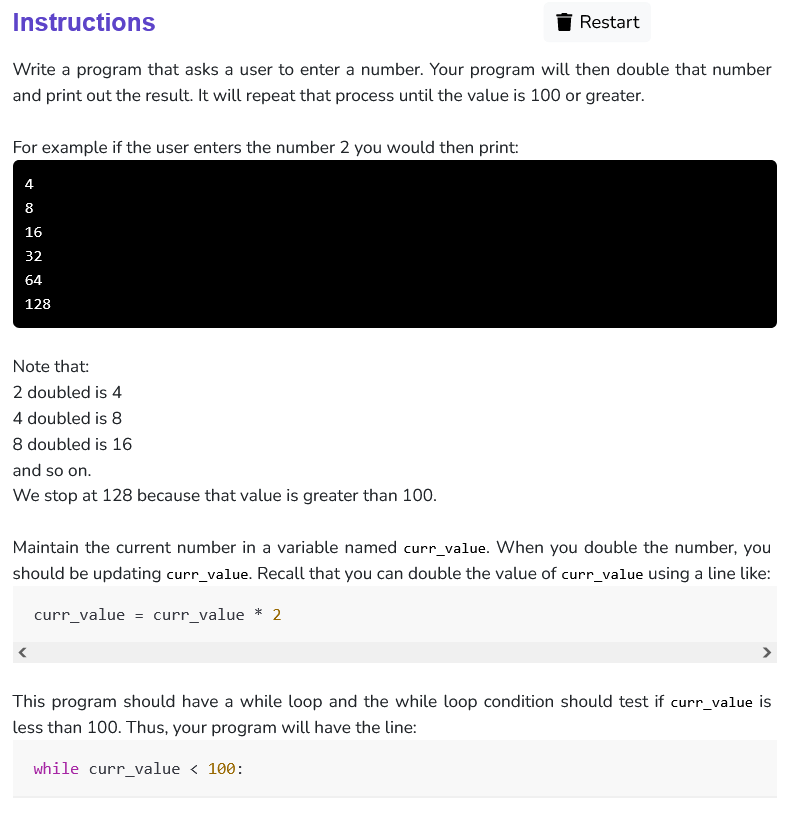

```python
def double_it(num):
    while(num<=100):
        print(int(num)*2)
        num = num*2

def main():
    curr_value = int(input("Enter a number: "))
    double_it(curr_value)

if __name__ == '__main__':
    main()
```
