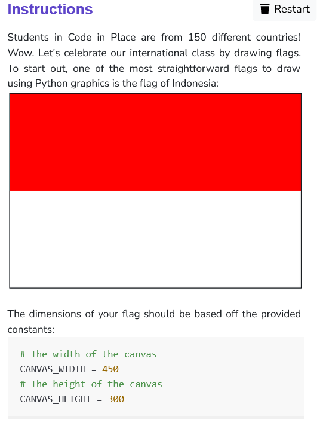
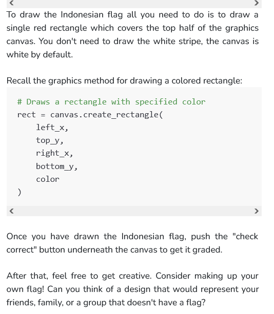

 

<br/>

```python
from graphics import Canvas
import random

CANVAS_WIDTH = 450
CANVAS_HEIGHT = 300

def main():
    canvas = Canvas(CANVAS_WIDTH, CANVAS_HEIGHT)
    rect = canvas.create_rectangle(
        0, 
        0, 
        CANVAS_WIDTH,
        CANVAS_HEIGHT/2, 
        'red'
    )

if __name__ == '__main__':
    main()
```


