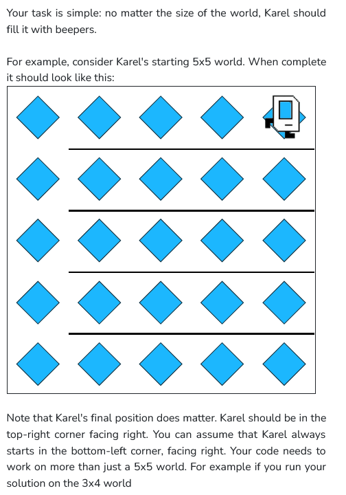
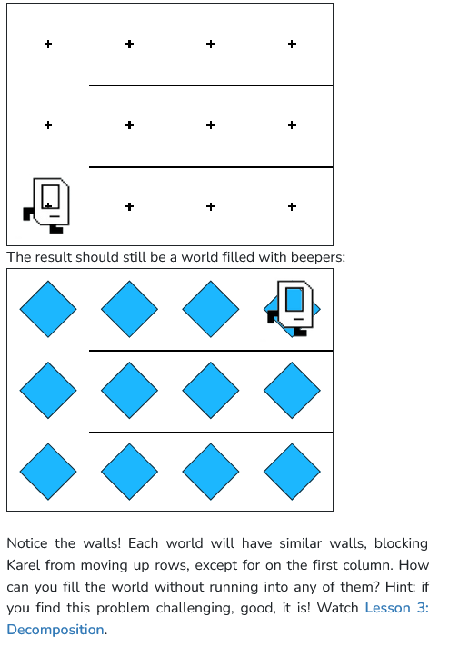

```python
from karel.stanfordkarel import *

"""
Karel should fill the whole world with beepers.
"""

def turn_right():
    for i in range (3):
        turn_left()

def fill_line():
    #first beeper needs to be put seperately
    put_beeper()
    #keeps moving and putting beepers until a wall is met
    while(front_is_clear()):
        move()
        put_beeper()

def back_to_initial_point():
    #assuming karel is facing right,
    #he has to turn the opposite direction
    for i in range (2):
        turn_left()
    #now he keeps moving forward until a wall is met
    while(front_is_clear()):
        move()

def go_to_next_line():
    #assuming karel is facing left
    #he has to be facing up now
    turn_right()
    #if front is clear, karel moves in position of the next line
    if(front_is_clear()):
        move()
    #turns right to meet pre-condition of fill_line function
    turn_right()
    #if beepers are already present where karel is,
    #then karel must have not moved and stayed in the topmost line
    #so now we move until a wall is met
    if(beepers_present()):
        while(front_is_clear()):
            move()


def main():
    while(front_is_clear()):
        fill_line()
        back_to_initial_point()
        go_to_next_line()
        
if __name__ == '__main__':
    main()
```
