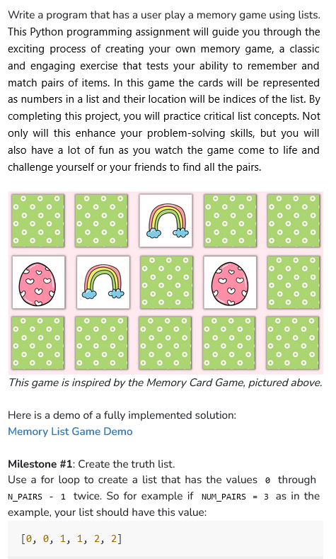
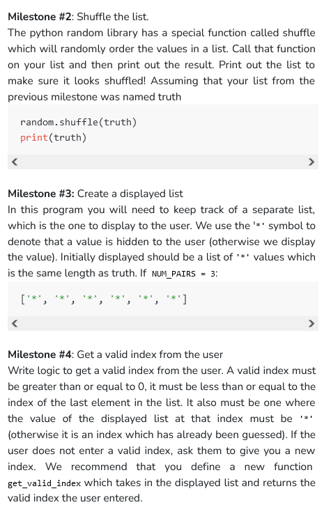
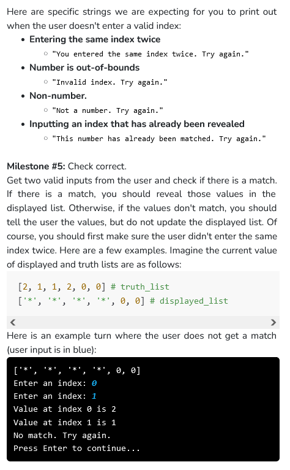
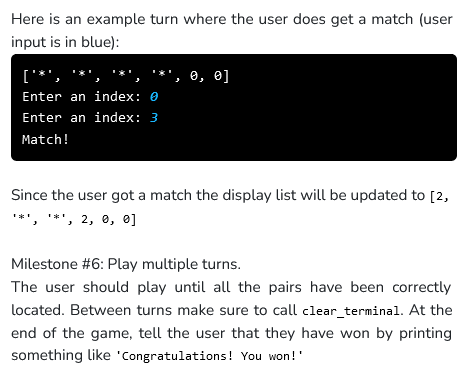

```python
import random

NUM_PAIRS = 3
truth_list = []
displayed_list = []

def create_list():
    for i in range(0, NUM_PAIRS):
        truth_list.append(i)
        truth_list.append(i)
        #storing each value twice

        displayed_list.append("*")
        displayed_list.append("*")
        #storing as many '*' as there are values

def main():
    create_list()
    #creates two lists

    random.shuffle(truth_list)
    #shuffles the truth list

    while check_finish() :
    #checks if all the indexes have been displayed or not      
        print(displayed_list)
        get_index()
        clear_terminal()
    #loop stops when all indexes have been displayed

    print("Congratulations! You won!")

def get_index():
    index1 = input("Enter an index: ")
    while check_valid(index1) :
    #while the error conditions are met and 'True' is received from check_valid function
        index1 = input("Enter an index: ")
    #inputs taken into index

    index1 = int(index1)
    #converting to integer for ease of use

    index2 = input("Enter an index: ")
    while check_valid(index2) :
        index2 = int(input("Enter an index: "))

    index2 = int(index2)

    while index1==index2 :
    #checking for 'same indexes entered' error
        print("You entered the same index twice. Try again.")
        index2 = int(input("Enter an index: "))

    #display values at the valid indices
    print("Value at index "+ str(index1) +" is "+ str(truth_list[index1]))
    print("Value at index "+ str(index2) +" is "+ str(truth_list[index2]))
    
    #displaying result accordingly
    if truth_list[index1]==truth_list[index2] :
        print("Match!")
        displayed_list[index1] = truth_list[index1]
        displayed_list[index2] = truth_list[index2]
        #if matched, reveal the numbers at the respective indices in the 'displayed_list'
    else :
        print("No match. Try again.")
        input("Press Enter to continue...")

def check_valid(index) :
    #checks ASCII char
    if index<"0" or index>"9" :
        print("Not a number. Try again.")
        return True
    #checks integer value, and if it's in range
    elif int(index)<0 or int(index)>NUM_PAIRS*2-1 :
        print("Invalid index. Try again.")
        return True
    #checks if the given index is hidden or revealed
    elif displayed_list[int(index)]!="*" : 
        print("This number has already been matched. Try again.")
        return True
    #returning false to terminate the while loop
    else :
        return False

def check_finish():
    for i in range (len(displayed_list)):
        if displayed_list[i] == "*":
            return True
            #if any unrevealed character found, loop should continue
    return False
    #if no unrevealed character found, loop should terminate

def clear_terminal():
    for i in range(20):
      print('\n')

if __name__ == '__main__':
    main()
```