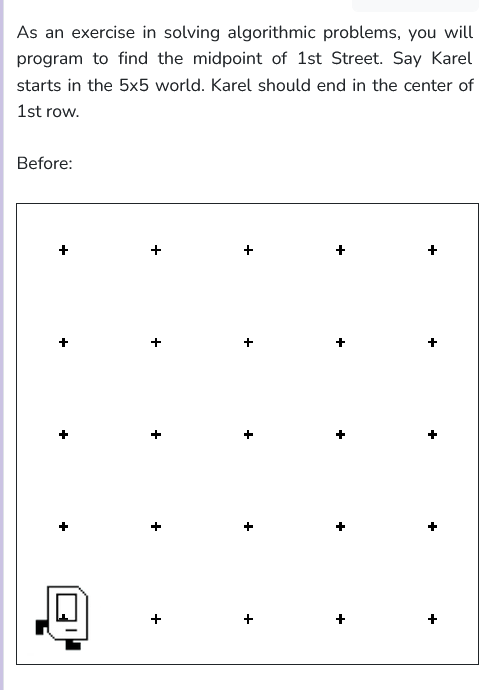
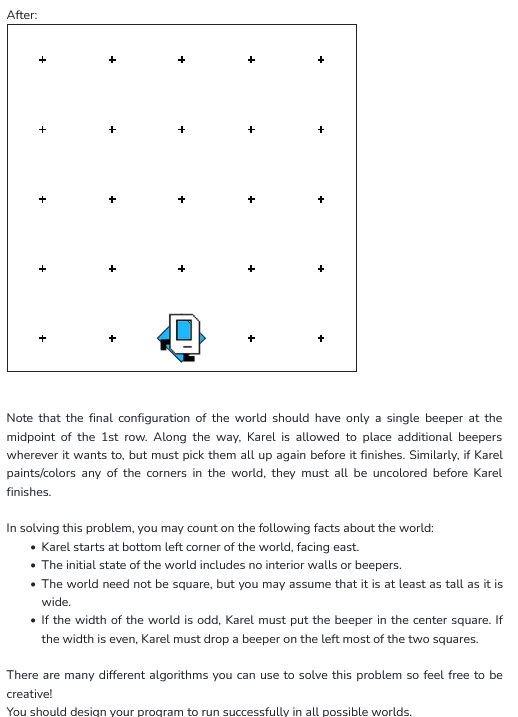

 

```python
from karel.stanfordkarel import *

"""
When you finish writing this file, Karel should be able to find
the midpoint
"""

def safe_move():
    if(front_is_clear()):
        move()

def turn_around():
    for i in range (2):
        turn_left()

def go_other_way():
    while(front_is_clear()):
        move()

    #then face west
    turn_around()

def step_back():
    turn_around()
    safe_move()

def check():
    safe_move()
    while(no_beepers_present() and front_is_clear()):
        move()
    if(beepers_present()):
        pick_beeper()
        step_back()
        put_beeper()

def main():
    #going to the bottom right corner
    go_other_way()

    #marking the corner with a beeper
    put_beeper()

    #going to the bottom left corner
    go_other_way()

    #putting a beeper there
    put_beeper()

    while front_is_clear():
        check()

    turn_around()
    while(no_beepers_present()):
        move()
    pick_beeper()

    if(not_facing_east()):
        turn_around()


if __name__ == '__main__':
    main()
```
