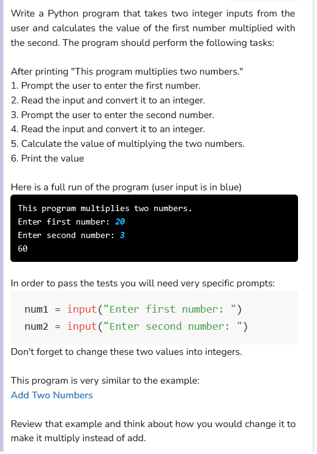

```python
"""
This program asks the user for two
integers and prints the value of the first number
multiplied with the second
"""

def main():
    print("This program multiplies two numbers.")

    #taking numbers as inputs
    num1 = int(input("Enter first number: "))
    num2 = int(input("Enter second number: "))

    print(num1*num2)

if __name__ == '__main__':
    main()
```
