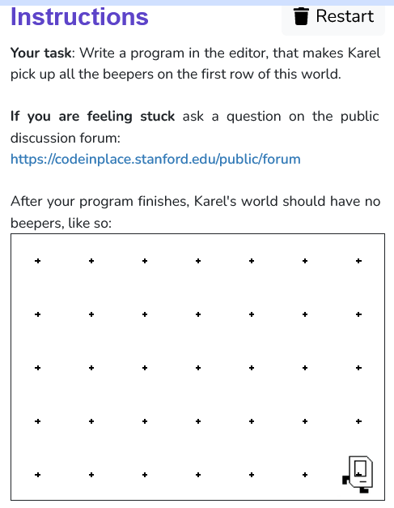

```python
from karel.stanfordkarel import *

# The warmup program defines a "main"
# function which should make Karel
# pick up all the beepers in the world.

def main():
    for j in range (3):
        move()
        for i in range (10):
            pick_beeper()
        move()

if __name__ == '__main__':
    main()
```
