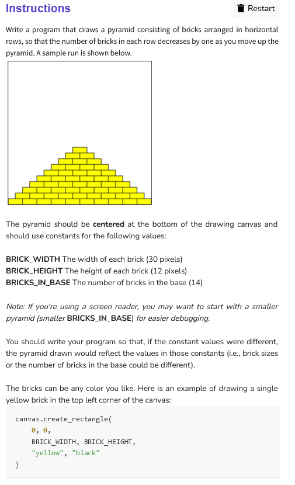

```python
from graphics import Canvas
import random

BRICK_WIDTH	= 30        # The width of each brick in pixels
BRICK_HEIGHT = 12       # The height of each brick in pixels
BRICKS_IN_BASE = 14     # The number of bricks in the base

CANVAS_WIDTH = BRICK_WIDTH*BRICKS_IN_BASE    # Width of drawing canvas in pixels
CANVAS_HEIGHT = BRICK_HEIGHT*BRICKS_IN_BASE*2     # Height of drawing canvas in pixels

canvas = Canvas(CANVAS_WIDTH, CANVAS_HEIGHT)

def main():
    row = BRICKS_IN_BASE
    while (row>0):
        row_of_bricks(row)
        row -= 1    

def row_of_bricks(row):
    start_x = (BRICK_WIDTH/2)*(BRICKS_IN_BASE-row)
    start_y = CANVAS_HEIGHT - BRICK_HEIGHT*(BRICKS_IN_BASE-row+1)
    end_x = start_x + BRICK_WIDTH
    end_y = CANVAS_HEIGHT - (BRICK_HEIGHT)*(BRICKS_IN_BASE-row)
    if row%2==0 :
        color = "pink"
    else :
        color = "pink"
    
    for i in range (row):
            canvas.create_rectangle(
                start_x, 
                start_y, 
                end_x, 
                end_y,
                color,
                "black"
            )
            start_x += BRICK_WIDTH
            end_x += BRICK_WIDTH

if __name__ == '__main__':
    main()
```