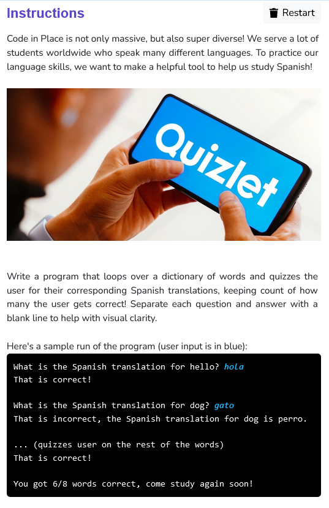

```python
def main():
    translations = {
        "hello": "hola",
        "dog": "perro",
        "cat": "gato",
        "well": "bien",
        "us": "nos",
        "nothing": "nada",
        "house": "casa",
        "time": "tiempo"
    }

    correct = 0

    for elem in translations:
        answer = input("What is the Spanish translation for "+ elem +"? ")
        if answer==translations[elem]:
            print("That is correct!\n")
            correct += 1
        else:
            print("That is incorrect, the Spanish translation for "+ elem +" is "+ translations[elem] + ".\n")
    
    print("You got "+ str(correct) + "/8 words correct, come study again soon!")

if __name__ == '__main__':
    main()
```