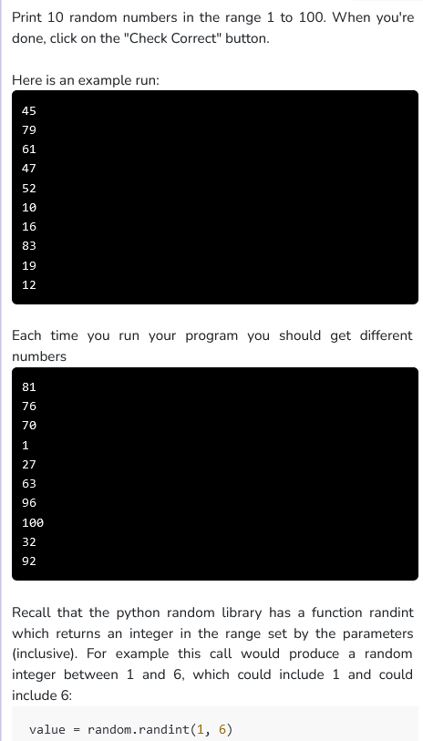

```python
import random

N_NUMBERS = 10
MIN_VALUE = 1
MAX_VALUE = 100

def main():
    #repeating using a for loop
    for i in range (10) :

        #generating a random number between 1 to 100
        num = random.randint(1, 100)

        #printing the number
        print(str(num))

if __name__ == '__main__':
    main()
```
