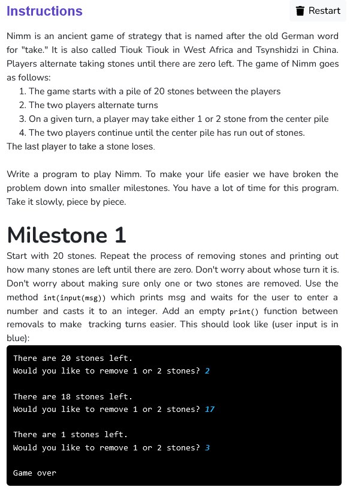
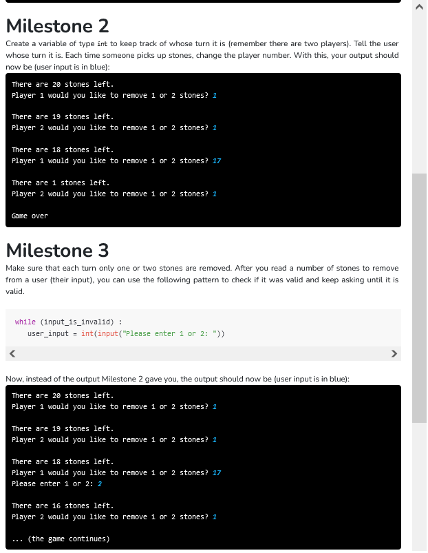
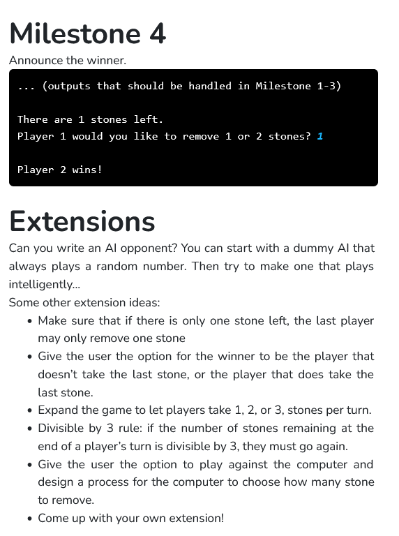

  

<br/>

```python

def ask_how_many_to_remove(player):

    #asking how many to remove
    to_remove = (input("Player "+ str(player) +" would you like to remove 1 or 2 stones? "))

    while(True):
        if to_remove == "1":
            break
        elif to_remove == "2":
            break
        else:
            to_remove = (input("Please enter 1 or 2: "))

            #to remove any trailing spaces
            to_remove.strip()

    #returning the value
    return to_remove

def main():

    stone = 20
    player = 1

    #printing no. of stones left
    print("There are " + str(stone) + " stones left.")

    while(stone > 0):
        #updating no. of stones
        stone = stone - int(ask_how_many_to_remove(player))

        #updating player
        if player==1:
            player = 2
        else:
            player = 1

        if stone > 0:
            #printing no. of stones left
            print("\nThere are " + str(stone) + " stones left.")

    print("\nPlayer "+ str(player) +" wins!")

if __name__ == '__main__':
    main()
```


