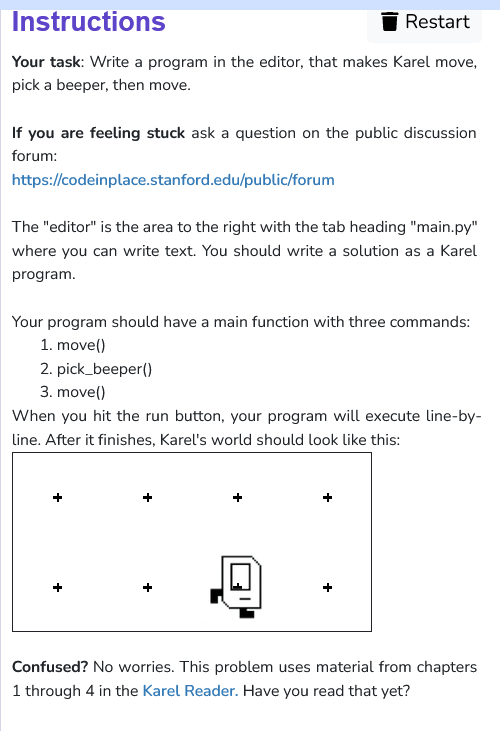

```python
from karel.stanfordkarel import *

# The warmup program defines a "main"
# function which currently just has one
# Command. Add two more commands to make karel: move(),
# pick_beeper(), move()

def main():
    move()
    pick_beeper()
    move()

if __name__ == '__main__':
    main()
```
