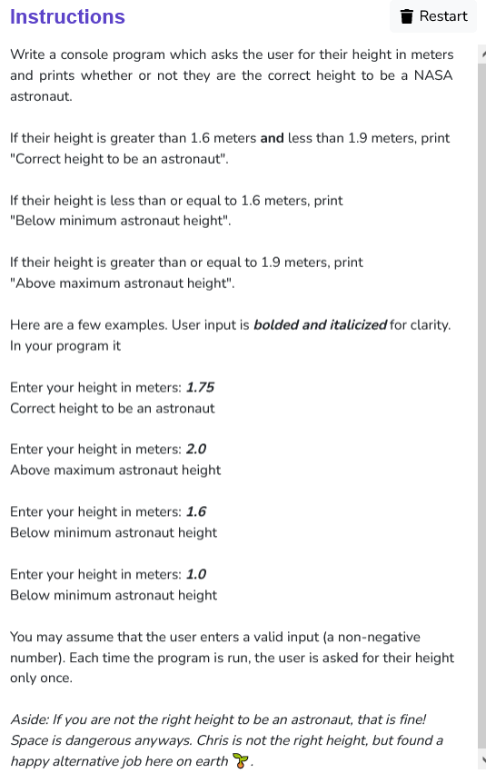

```python
def main():
    height = input("Enter your height in meters: ")
    while True :
        if height<"0" or height>"9" :
            print("Not a number. Try again")
            height = input("Please enter your height in meters: ")
        else :
            height = float(height)
            break

    if height>1.6 and height<1.9 :
        print("Correct height to be an astronaut")
    elif height<=1.6 :
        print("Below minimum astronaut height")
    else :
        print("Above maximum astronaut height")

if __name__ == "__main__":
    main()
```