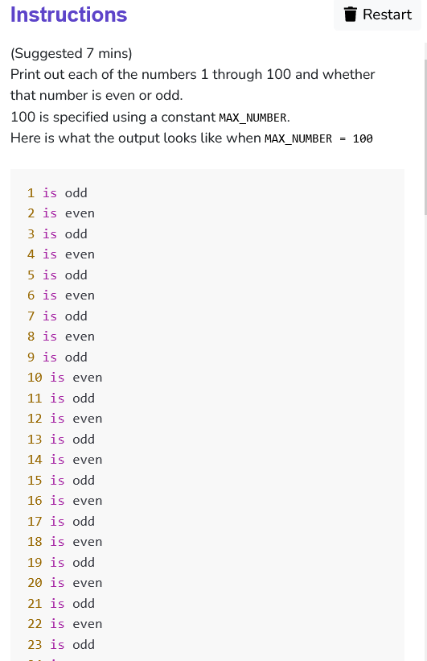

```python
# print numbers from 1 up until MAX_NUMBER, inclusive
MAX_NUMBER = 100

def main():
    pass
    for i in range (MAX_NUMBER) :
        if((i+1)%2==0) :
            num_type = "even"
        else :
            num_type = "odd"
        print(str(i+1) + " is " + num_type)

if __name__ == "__main__":
    main()
```