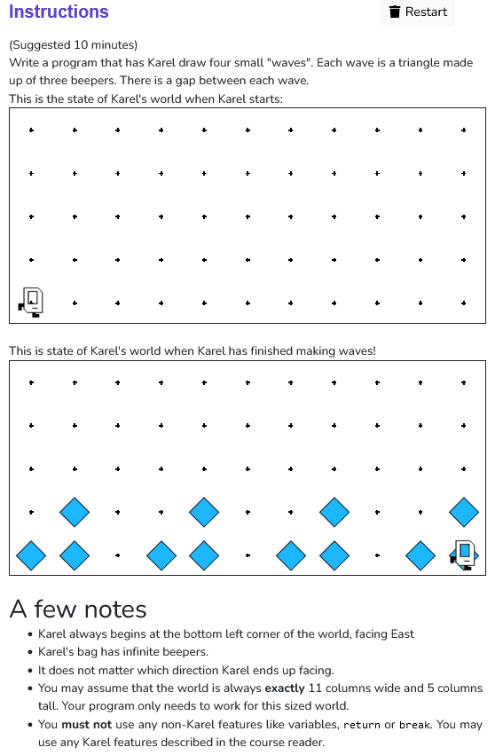

```python
from karel.stanfordkarel import *

def draw_wave() :
    put_beeper()
    move()
    put_beeper()
    turn_left()
    move()
    put_beeper()
    turn_left()
    turn_left()
    move()
    turn_left()

def main():
    for i in range (4):
        draw_wave()
        if front_is_clear() :
            move()
            move()
   

# don't edit these next two lines
# they tell python to run your main function
if __name__ == '__main__':
    main()
```