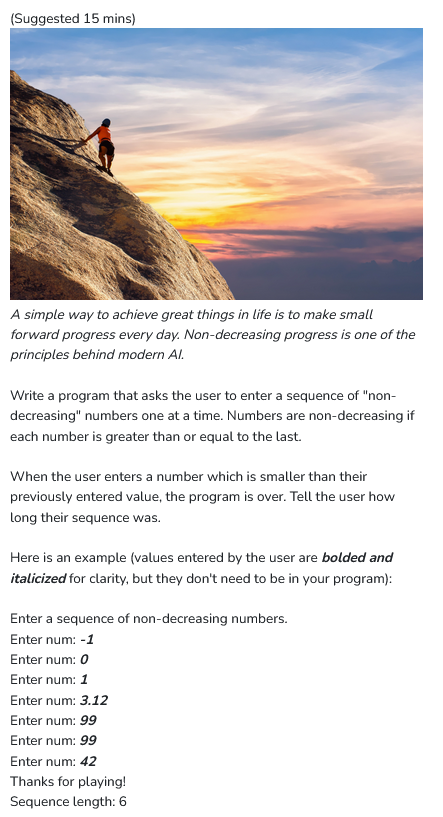
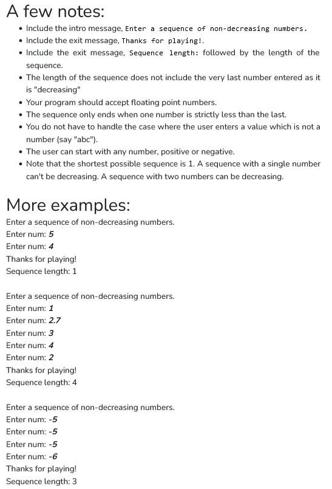

```python
num_list = []

def add_num(num) :
    num_list.append(num)

def check_num() :
    last = len(num_list)-1
    if len(num_list)==1 :
        return True
    elif num_list[last]>=num_list[last-1] :
        return True
    else :
        return False

def main():
    print("Enter a sequence of non-decreasing numbers.")
    while True :
        num = input("Enter num: ")
        add_num(num)    
        if check_num() == False :
            break
    print("Thanks for playing!")
    print("Sequence length: " + str(len(num_list)-1))
if __name__ == "__main__":
    main()
```