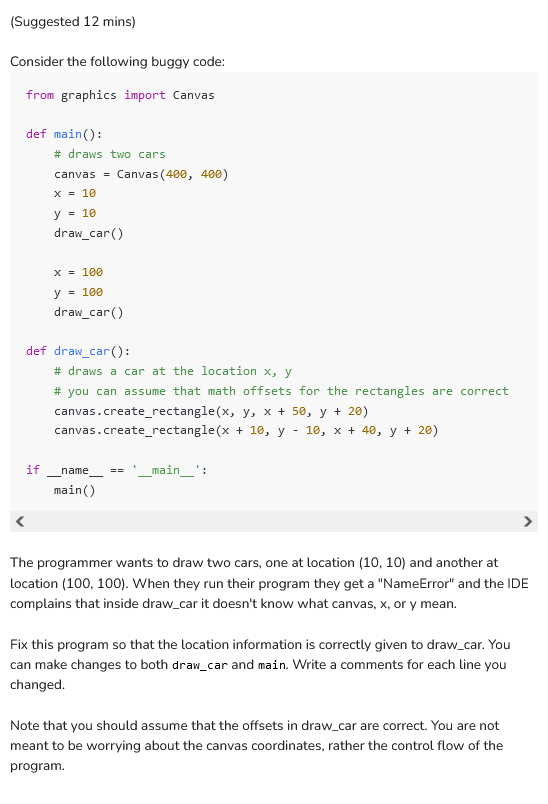

```python
from graphics import Canvas

def main():
    # draws two cars
    canvas = Canvas(400, 400)
    x = 10
    y = 10
    draw_car(canvas, x, y)
    #passed three parameters to draw car as required

    x = 100
    y = 100
    draw_car(canvas, x, y)
    #passed three parameters to draw car as required

def draw_car(canvas, x, y):
    # draws a car at the location x, y
    # takes canvas and the values x and y as parameters
    canvas.create_rectangle(x, y, x + 50, y + 20)
    canvas.create_rectangle(x + 10, y - 10, x + 40, y + 20)

if __name__ == '__main__':
    main()
```