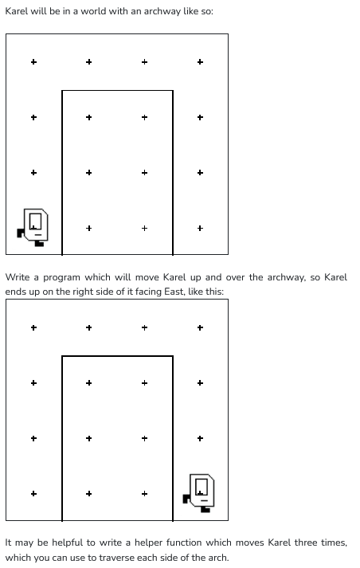

```python
from karel.stanfordkarel import *

def turn_right():
    for i in range (3):
        turn_left()

def move_up():
    #pre : karel's facing east
    #post: karel's facing east

    while(front_is_blocked()):
        turn_left()
        move()
        turn_right()

def move_ahead():
    #pre : karel's facing east
    #post: karel's facing east

    while(front_is_clear()):
        move()

def move_down():
    #pre : karel's facing east
    #post: karel's facing east

    #make karel face south
    turn_right()

    #keep moving until bottom reached
    while(front_is_clear()):
        move()

    #face east
    turn_left()


def main():
    #pre: Karel's facing East in the bottom left corner
    move_up()
    move_ahead()
    move_down()

if __name__ == '__main__':
    main()
```
