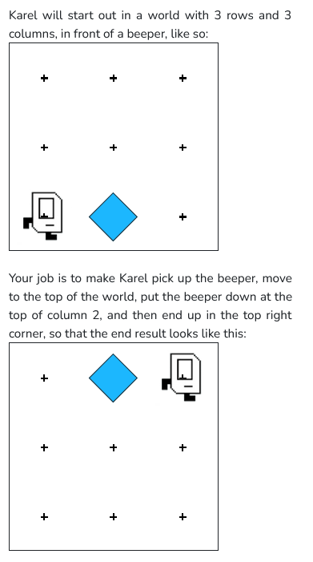

 

```python

from karel.stanfordkarel import *

def main():
    #Karel starts facing East in the bottom left corner of the world
    #and ends facing East in the bottom right corner of the world.

    #find beeper
    while no_beepers_present() :
        move()
    
    #pick up beeper
    pick_beeper()
    turn_left() #to face the top

    #reach top
    while front_is_clear() :
        move()

    #place beeper and reach corner
    put_beeper()
    for i in range (3) :
        turn_left()
    while front_is_clear() :
        move()

if __name__ == '__main__':
    main()
```