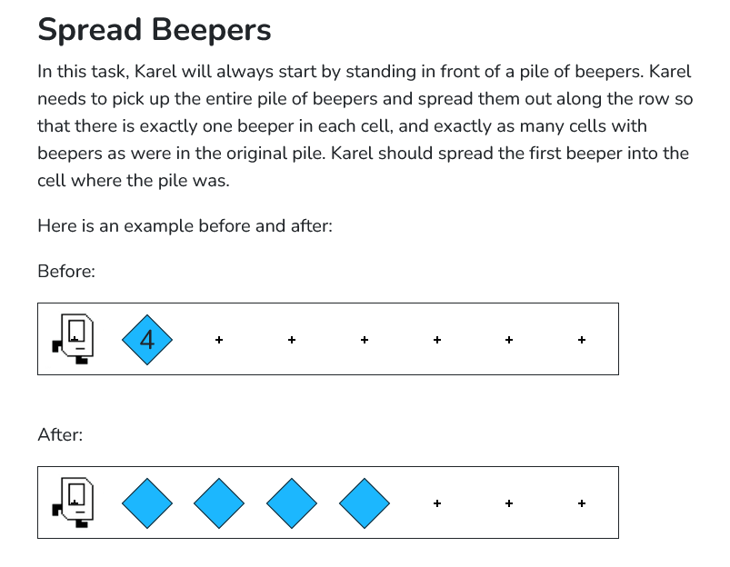
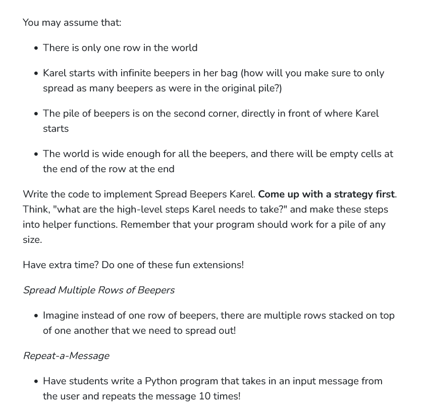

```python
from karel.stanfordkarel import *

"""
Each row starts with a stack of beepers. Karel should pick them
up, one at a time, and spread them down the row. 
Caution! Karel can't count, and starts with infinite beepers in
her bag. How can you solve this puzzle?
"""

def spread():
    #once beepers found, karel should pick one up,
    while(beepers_present()):
        pick_beeper()
        
        if(beepers_present()):
            #karel moves forward
            move()
            
            #karel looks for the next open space
            while(beepers_present()):
                move()

            #once found, karel puts a beeper there
            put_beeper()

            #karel turns the other way to go back
            opposite_direction()

            #karel goes back to the beepers
            while(front_is_clear()):
                move()

            #karel turns towards east
            opposite_direction()

            #karel moves forward
            #to meet the pre condition for spread
            move()

        else:
            #karel places the beeper back
            put_beeper()

            #karel turns around and moves forward
            opposite_direction()
            move()

            #karel turns around again to face east
            opposite_direction()

def opposite_direction():
    for i in range (2):
        turn_left()

def main():
    #karel should move forward
    move()
    spread()
    
if __name__ == '__main__':
    main()
```
