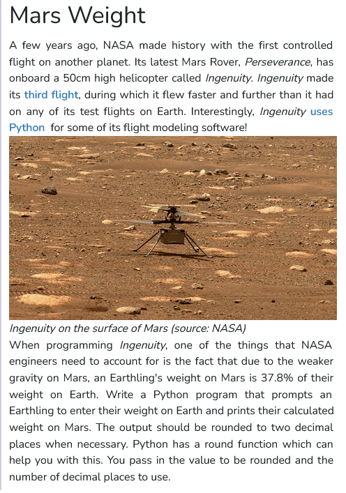

```python
"""
Prompts the user for a weight on Earth
and prints the equivalent weight on Mars.
"""

def main():
    
    #taking weight input
    earth_weight = int(input("Enter a weight on Earth : "))
    
    #equivalent weight on mars
    mars_weight = 0.378*earth_weight

    #printing mars weight
    print("The equivalent weight on Mars : "+str(mars_weight))

    pass

if __name__ == "__main__":
    main()
```
