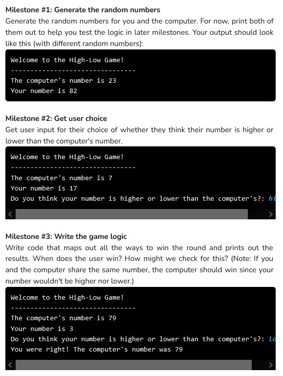

```python

import random

NUM_ROUNDS = 5

def main():
    print("Welcome to the High-Low Game!")
    print('--------------------------------')
    
    score = 0

    #Rounds
    for i in range (NUM_ROUNDS) :
        print("Round "+str(i+1))

        #Random Numbers
        player_num = random.randint(1,100)
        computer_num = random.randint(1,100)

        print("Your number is "+str(player_num))
        guess = input("Do you think your number is higher or lower than the computer's?: ")

        correct = 'y'
        #Check Player Input
        if guess == "lower" or guess == "Lower" :
            if player_num > computer_num :
                correct = 'n'
        elif guess == "higher" or guess == "Higher" :
            if player_num < computer_num :
                correct = 'n'

        #Score
        if correct == 'y' :
            print("You were right! The computer's number was " + str(computer_num))
            score += 1
        else :
            print("Aww, that's incorrect. The computer's number was " + str(computer_num))
        print("Your score is now " + str(score) + '\n')

    if score == 5 :
        print("Wow! You played perfectly!\n")
    elif score >= round(NUM_ROUNDS/2,0) :
        print("Good job, you played really well!\n")
    else :
        print("Better luck next time!\n")

if __name__ == "__main__":
    main()

```