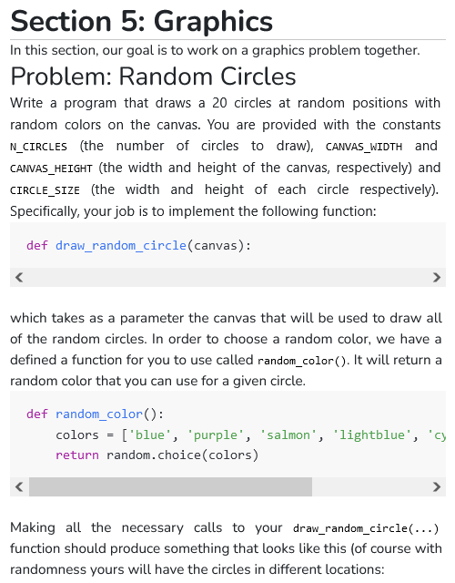
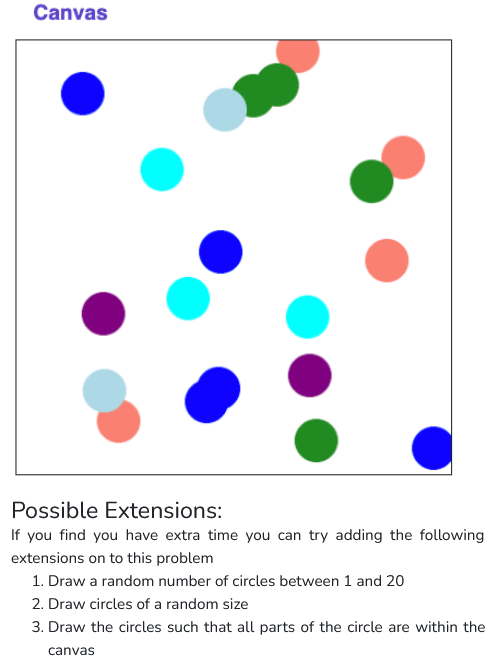

 

```python

from graphics import Canvas
import random

CANVAS_WIDTH = 300
CANVAS_HEIGHT = 300

n_circle = 100

def main():
    print('Random Circles')
    canvas = Canvas(CANVAS_WIDTH, CANVAS_HEIGHT)
    for i in range (n_circle) :
        color = random_color()
        random_circle(canvas, color)
    
def random_color():
    colors = ['black', 'pink', 'blue', 'purple', 'salmon', 'lightblue', 'cyan', 'forestgreen']
    return random.choice(colors)

def random_circle(canvas, color):
    size = random.randint(10, 30)
    x = random.randint(0, CANVAS_WIDTH - size)
    y = random.randint(0, CANVAS_HEIGHT - size)
    
    canvas.create_oval(
        x,
        y,
        x + size,
        y + size,
        color
    )

if __name__ == '__main__':
    main()

```