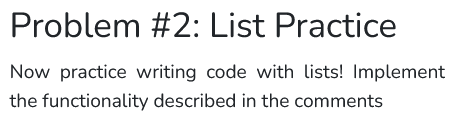

```python

def main():
    # Create a list called `fruit_list` that contains the following fruits: 
    # 'apple', 'banana', 'orange', 'grape', 'pineapple'.
    fruit_list = ['apple', 'banana', 'orange', 'grape', 'pineapple']
    
    # Print the length of the list.
    print(len(fruit_list))
    
    # Add 'mango' at the end of the list. 
    fruit_list.append('mango')

    # Print the updated list.
    print(fruit_list)
    
if __name__ == "__main__":
    main()

```